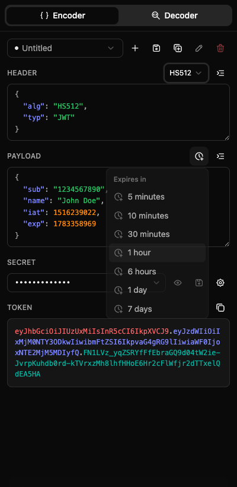

# JWT Workbench

A fast, private JSON Web Token toolkit that lives in your browser's **side panel** — one click away while you work. Unlike online decoders, everything runs locally: your tokens, payloads, and secrets never leave the browser and no network requests are made.



## Features

- **Encoder** — edit header + payload as JSON with live syntax highlighting and one-click formatting; choose the algorithm (HS256/HS384/HS512) from a dropdown; the signed token updates in real time; copy with one click.
- **Expiration presets** — set the `exp` claim to now + a preset (5 minutes → 1 year) straight into the payload.
- **Decoder** — one button decodes a JWT straight from the clipboard, or paste manually. Shows color-highlighted header/payload, human-readable `exp`/`iat`/`nbf`, an "Expired" badge, and optional signature verification.
- **Projects** — save header + payload + secret as a named project. Full CRUD (new, save, save as, rename, delete), last opened project restored. Turn any decoded token into a new project in one click.
- **Secret library** — save signing secrets with friendly names and reuse them across projects, in both the encoder and decoder.
- **System theme** — light/dark follows your OS automatically.

## Tech stack

[WXT](https://wxt.dev) (Manifest V3) · React 19 · TypeScript · Tailwind CSS v4 · [shadcn/ui](https://ui.shadcn.com) · [@tabler/icons-react](https://tabler.io/icons) · [jose](https://github.com/panva/jose) · `chrome.storage.local`

> Note: the shadcn registry is unreachable in this environment, so the components under `components/ui/` are hand-written in the shadcn "new-york" style with Tabler icons. Add new ones by hand rather than via the shadcn CLI.

## Project layout

```
entrypoints/
  background.ts          # opens the side panel on toolbar-icon click
  sidepanel/             # side panel app (index.html, main.tsx, App.tsx)
components/
  ui/                    # shadcn/ui primitives (hand-written)
  EncoderTab / DecoderTab / ProjectBar / SecretPicker / …
hooks/                   # useProjects, useSecrets, useStorageList
lib/
  jwt.ts                 # sign / verify / decode / isJwt (jose)
  storage.ts             # Project & Secret types + chrome.storage items
assets/tailwind.css      # theme tokens + system dark mode
public/icon/             # extension icons (16–128px)
```

## Prerequisites

- Node.js 18+
- [pnpm](https://pnpm.io) (`corepack enable` will provide it)

## Development

```sh
pnpm install          # install deps (runs `wxt prepare` postinstall)
pnpm dev              # dev build + HMR; launches a Chrome instance with the extension loaded
pnpm dev:firefox      # same, for Firefox
```

`pnpm dev` opens a browser with the extension already installed and hot-reloads on save. Click the JWT Workbench toolbar icon to open the side panel.

### Type-check

```sh
pnpm compile          # tsc --noEmit
```

## Debugging

- **Side panel UI** — right-click inside the panel → **Inspect** to open DevTools for the panel document.
- **Background service worker** — go to `chrome://extensions`, find JWT Workbench, and click the **service worker** link to open its DevTools (useful for the side-panel-open-on-click behavior in `entrypoints/background.ts`).
- **Stored data** — in the side panel's DevTools console: `await chrome.storage.local.get()` shows saved `projects`, `secrets`, and UI state.
- **Manual reload** — dev mode hot-reloads automatically; if a change to the manifest or background isn't picked up, reload the extension from `chrome://extensions`.

### Loading a production build manually

```sh
pnpm build
```

1. Open `chrome://extensions` and enable **Developer mode**.
2. Click **Load unpacked** and select `.output/chrome-mv3`.
3. Click the toolbar icon to open the side panel.

### End-to-end sanity check

Branded Chrome 137+ ignores `--load-extension`, so automated extension testing needs **Chrome for Testing** (e.g. via `npx @puppeteer/browsers install chrome@stable`). Point a puppeteer-core script at that binary with `--load-extension=.output/chrome-mv3` and drive `chrome-extension://<id>/sidepanel.html`.

## Building & releasing

### 1. Bump the version

Edit `version` in `package.json` (WXT copies it into the generated `manifest.json`). Use semver; the store requires a higher version than the last upload.

### 2. Produce the store package

```sh
pnpm zip              # builds and writes a zip to .output/
pnpm zip:firefox      # Firefox variant, if publishing there too
```

This runs a production build and packages `.output/chrome-mv3` into an uploadable `.zip`.

### 3. Publish to the Chrome Web Store

1. Sign in to the [Chrome Web Store Developer Dashboard](https://chrome.google.com/webstore/devconsole) (one-time \$5 registration fee).
2. **Add new item** (first release) or open the existing item → **Package → Upload new package**, and upload the zip from `.output/`.
3. Fill in the store listing — copy is ready in [store-listing.md](store-listing.md): name, short/detailed description, category, screenshots, and the required **permission justifications**, **single purpose statement**, and **privacy policy**.
4. Complete the **Privacy practices** tab (this extension collects no data and makes no network requests — declare accordingly).
5. **Submit for review.** Review typically takes a few hours to a few business days.

### Assets you still need to supply

- **Screenshots** — 1280×800 or 640×400, up to 5. Ready-made caption frames are in [docs/store-screenshots.html](docs/store-screenshots.html): open it in Chrome, drop your side-panel screenshot into each 1280×800 panel, hide the controls, and capture. Captions are also listed in [store-listing.md](store-listing.md).
- **Store icon** — 128×128 (already in `public/icon/128.png`).
- **Promo tiles** — optional; text suggestions in [store-listing.md](store-listing.md).
- A hosted **privacy policy URL** (draft text is in the listing doc).

## Privacy

JWT Workbench makes no network requests and transmits no data. Projects and secrets are stored locally via `chrome.storage.local`. The clipboard is read only when you press **Decode from clipboard**.

Because storage uses the `local` area (not `sync`), your projects and secrets stay on **this browser profile only** — they are **not** synced to other devices signed into the same browser account. This is deliberate: signing secrets should not be pushed to the cloud, and `sync` has small per-item quotas. To move data between machines, export/import it manually.

## License

MIT
